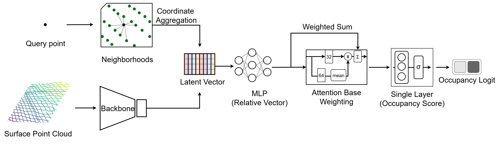
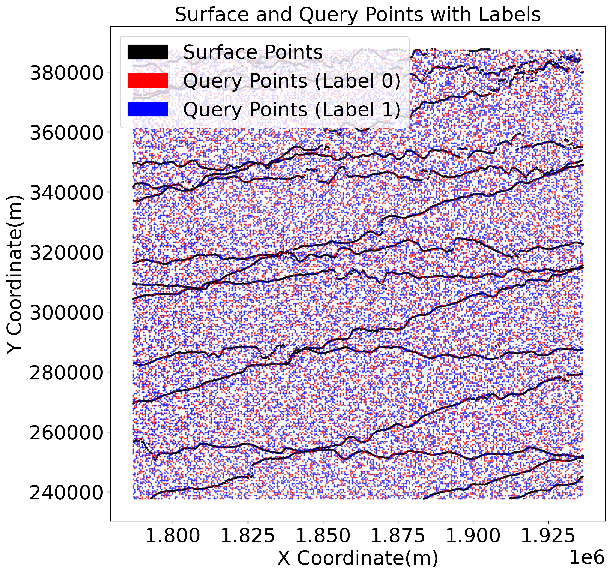
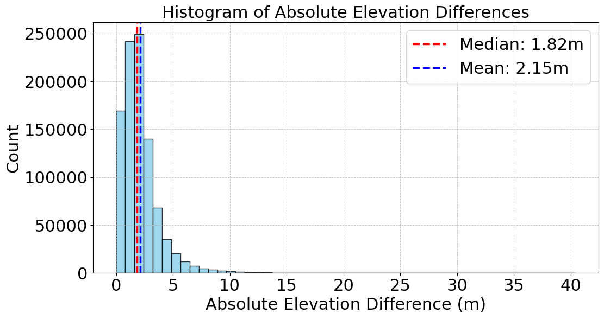

# Point-ICENet: A Point Convolutional Network for Polar Surface Reconstruction from Sparse Altimetry

## Abstract
Generating high-resolution, monthly Digital Elevation Models (DEMs) of polar regions is critical for monitoring ice dynamics, but is fundamentally challenged by the sparse, unstructured nature of satellite altimetry. Conventional methods require multi-year data aggregation, masking short-term changes, while standard deep learning approaches necessitate an initial gridding step that introduces interpolation artifacts and information loss. To address this, we introduce **Point-ICENet**, a point-convolutional framework that operates directly on unstructured altimetry points and performs attention-weighted, learned interpolation to reconstruct ice sheet surfaces from sparse, single-month data without pre-gridding. Trained on synthetic point–surface pairs sampled from the **Reference Elevation Model of Antarctica (REMA)**, the model is evaluated on unseen monthly **CryoSat-2** data at Antarctic test sites and, without any region-specific tuning, transfers to Greenland. By learning intrinsic geomorphological priors from synthetic data, our framework performs a context-aware, learned interpolation across vast data gaps without the flawed assumptions of traditional methods. In Antarctica, **Point-ICENet** attains *RMSE = 2.8 m* relative to REMA and *4.9 m* relative to TanDEM-X PolarDEM; in Greenland, it maintains competitive accuracy (*RMSE = 2.95 m* vs. ArcticDEM) while preserving geomorphological texture. Compared with **Inverse Distance Weighting (IDW)**, **Radial Basis Functions (RBF)**, and **Ordinary Kriging (OK)**, Point-ICENet yields lower errors overall and uniquely preserves the subtle, flow-aligned surface fabric characteristic of ice-dynamics features that are systematically erased by other techniques. Because the approach generalizes across regions and months without a prior gridding step, it enables temporally resolved DEMs from sparse altimetry and establishes a foundation for scalable, data-driven polar surface reconstruction.

---



---

## Repository Overview
This repository provides the implementation of **Point-ICENet**, including:
- Training scripts for learning surface occupancy from synthetic point–surface pairs.
- Inference and surface reconstruction from sparse CryoSat-2 altimetry.
- Optional post-processing scripts for DEM generation and evaluation.

```
├── app/
│   └── surface_reconst.py       
├── networks/                     
├── lightconvpoint/               
├── utils/                       
├── train.py                                        
```

---

## Data Preparation
Before training, create the following directory structure:

```
data/
├── train_data/
│   ├── surf_pts/                  # Input surface point patches
│   ├── query/                     # Query point sets
│   ├── query_label/               # Occupancy labels 
│   └── List of patch IDs
├── test_data
```

Each sample corresponds to a `(surface patch, query patch, label file)` triple.

Example of surface and query point patches:


---

## Training
Run the main training script:
```bash
python train.py 
```

Trained models will be saved automatically under:
```
model/Cry2_cryosat
```

---

## Surface Reconstruction
After training, you can reconstruct surfaces using:
```bash
python app/surface_reconst.py 
```

This script will generate dense point clouds from sparse satellite input data, depending on the configuration.

---

## Post-processing
For DEM assembly and filtering, you can:
- Stitch all predicted patches together using a simple merge script, **or**
- Apply the patch-wise merging and interior extraction strategy described in the paper (150 km tiles with 33 % overlap, extracting 100 km interiors).

Both approaches are valid and produce consistent large-scale DEMs.

Example of elevation difference histogram: predicted Reference DEM (REMA) - DEM:



---

## For Object Reconstruction
If your goal is **volumetric object reconstruction** rather than large-scale topography, we recommend using the original **POCO** framework.

---
